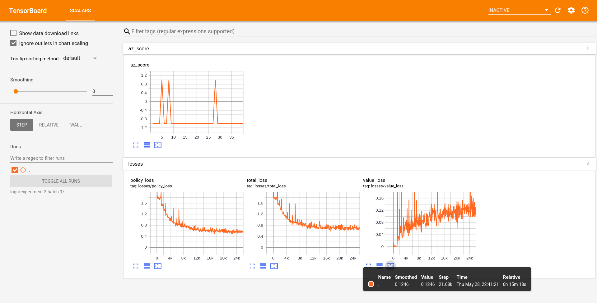

# AlphaZero Othello

Implementation of [AlphaZero](https://deepmind.com/blog/article/alphazero-shedding-new-light-grand-games-chess-shogi-and-go) for board game [Othello](https://en.wikipedia.org/wiki/Othello).

### Dependencies
`open-spiel`  
`pytorch` 
`tensorboard` 
`numpy` 

### Training
`python train.py --experiment 2 --batch 2 --resume False`   
You can replace experiment and batch number with whatever number you wish. 
If resume is True then it will resume the training from previous checkpoint if exists.
 
In training 5 Self-Play workers, 1 Training Worker and 1 Evaluation worker will run in parallel. 
Evaluation worker plays latest trained model of AlphaZero against Vanilla [Monte Carlo Tree Search](https://en.wikipedia.org/wiki/Monte_Carlo_tree_search) and logs output in Tensorboard.
 
### Visualizing training
To visualize your training progress, run following command   
`tensorboard --logdir logs/experiment-2-batch-2`   
Here you must provide experiment and batch number you gave for training.  
Sample Training log is below

### Evaluation
To play against your trained AlphaZero Othello  
`python eval.py --experiment 2 --batch 2 --vs human`   
To make AlphaZero play against vanilla MCTS  
`python eval.py --experiment 2 --batch 2 --vs vmcts`   
To make it play against itself  
`python eval.py --experiment 2 --batch 2 --vs self`   